# OkHttpAndRetrofit

# OkHttp
## Overview
- Là một thư viện được Square phát triển với mục đích gửi và nhận các request mạng dựa trên HTTP.
- Là một HTTP client nhanh, hiệu quả:
	+ Hỗ trợ HTTP/2 và SPDY cho phép tất cả các request đến cùng một máy chủ để chia sẻ một socket.
	+ Nhóm connection giảm độ trễ request
	+ GZIP: Giảm kích thước tải xuống.
	+ Caching
	+ Khôi phục từ các sự cố mạng
	+ Hỗ trợ các cuộc gọi đồng bộ, không đồng bộ
	+ Chuyển hướng
	+ Thử lại
- OkHttp cung cấp một triển khai các giao diện HttpUrlConnection và Apache Client bằng cách làm việc trực tiếp trên Java Socket mà không cần sử dụng bất kỳ phụ thuộc nào.
- OkHttp được xây dựng dựa trên Okio, một thư viện bổ sung cho java.io và java.nio để giúp truy cập, lưu trữ và xử lý dữ liệu của bạn dễ dang hơn, nó cung cấp I/O nhanh và 
bộ đệm thay đổi kích thước. Vì thế OkHttp phụ thuộc vào Okio nhưng Okio có thể được sử dụng riêng.
- Sử dụng OkHttp rất dễ dàng, Request/response được thiết kế với fluent builders và immutability.

## Thực hành

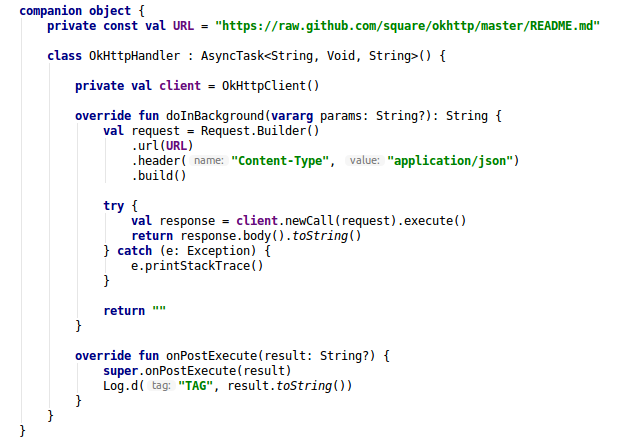

## Interceptor
- Interceptor là một cơ chế mạnh mẽ có thể giám sát, điều chỉnh và có thể chặn các request và response. Thông thường sử dụng để thêm, xóa, sửa các Headers trên request hoặc response trả về.

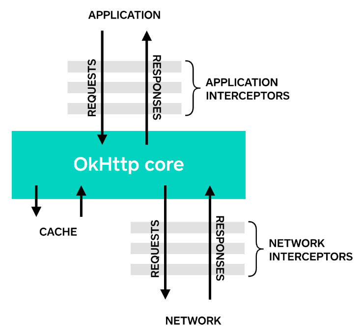

- Interceptor được chia làm 2 loại:
	+ Application Interceptor:
		+ Đây là những interceptor có cấp độ cao được sử dụng để tác động tới các request hoặc response.
		+ Thường được sử dụng để viết lại các Header/query ở cả request và response.
		+ Được gọi ngay cả khi response được nạp từ cache.
		+ Được phép short-circuit và không gọi Chain.proceed()
		+ Được phép retry và nhiều call đến Chain.procees()
	+ Network Interceptor:
		+ Đây là những interceptor có cấp độ thấp được sử dụng để theo dõi các request và response
		+ Nó rất hữu ích để theo dõi việc redirect, retry.
		+ Nó không được gọi nếu response không được lưu trữ.
- Ví dụ: Interceptor đơn giản để ghi lại request và responce

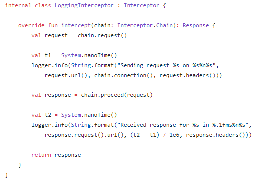

- *chain.proceed(request)* là một phần quan trọng trong việc thực hiện của Interceptor, đây là nơi tất cả các công việc HTTP xảy ra, tạo response đáp ứng request.

- Kết quả:

	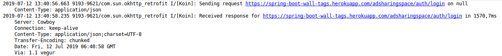

- Rewriting Requests: Interceptor có thể add, remove, replace request Header.

	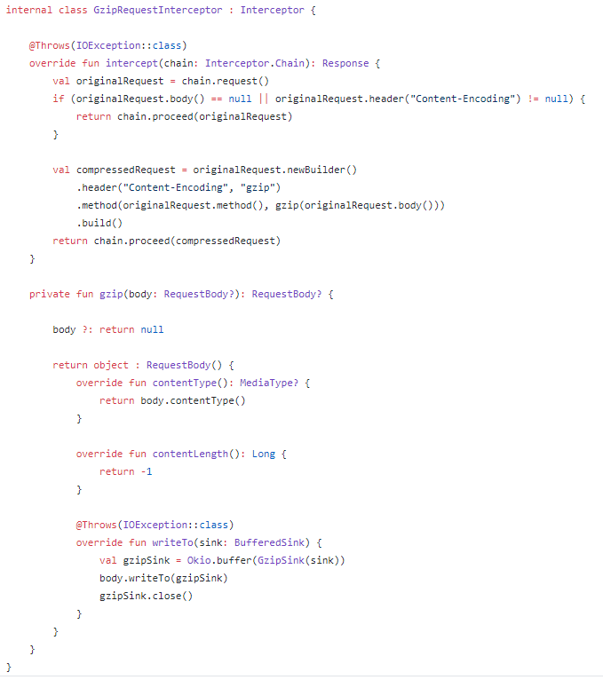

- Rewriting Response: Có thể viết lại response header, response body.

	

## Cách Android OkHttp cache làm việc
- Việc fetch một thứ gì đó qua mạng vừa chậm, vừa tốn kém, các response lớn đòi hỏi nhiều thời gian giữa client và server. Do đó, khả năng lưu trữ và sử dụng lại các tài nguyên đã tải trước đó là một vấn đề quan trọng trong việc cải thiện hiệu suất, tăng trải nghiệm cho người dùng.
- Cơ chế OkHttp caching:

	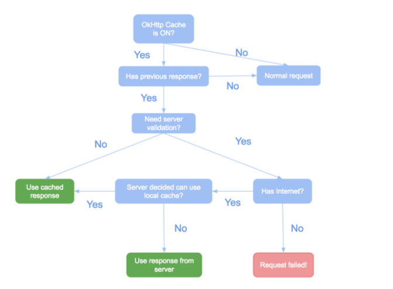

- Enable cache:

	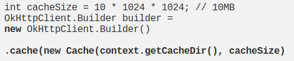

- Làm thế nào để nó hoạt động?
	+ Không phải làm cả, nó sẽ tự động phân tích cú pháp header liên quan đến bộ đệm từ server và lưu trữ response vào cache dir. Lần tới, khi gửi request nó sẽ tự động thêm header tương ứng.

	+ Khi server trả về response, nó cũng bao gồm một tập hợp các HTTP headers, content-type, lenght, caching directives, validation token,...

	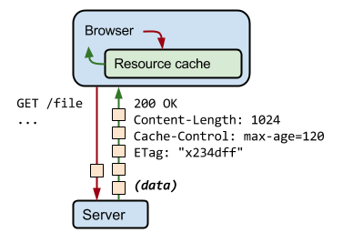

	+ Ví dụ trên: kích thước response là 1024 byte, client lưu trữ vào cache trong 120s, validate token *x234dff*

- Làm thế nào để nó hoạt động offline?
	+ Khi server cung cấp max-age, nó báo cho OkHttp rằng có thể lưu trữ response và sử dụng ngoại tuyến.
	+ Nếu max-age không có sẵn hoặc hết hạn nhưng bạn vẫn muốn sử dụng dữ liệu cục bộ, bạn có thể làm như sau:
		
		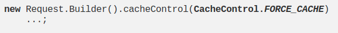

	+ Flow:

		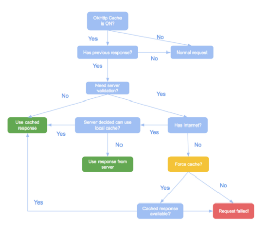

	+ Tổng quát hơn, nếu bạn luôn muốn sử dụng local cache bất cứ khi nào không có Internet:

		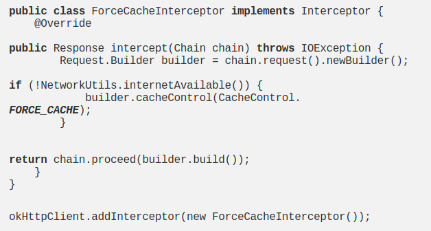

- Cách server quyết định client có thể sử dụng dữ liệu được lưu trữ trong cache:
	+ Client sẽ gửi một thứ gì đó như timestamp hoặc Etag của request cuối cùng
	+ Server sẽ check xem dữ liệu có thay đổi gì trong thời gian đó hay không.
	+ Nếu không có gì thay đổi, server chỉ trả về mã *304 Not Modified* thông báo rằng response có trong cache không thay đổi và được gia hạn thêm thời gian max-age.

		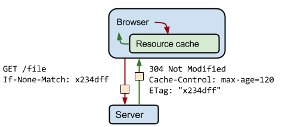

- Có nên sử dụng OkHttp để lưu trữ dữ liệu không? Chỉ cần sử dụng *FORCE_CACHE* là đã có dữ liệu được lưu trữ?
	+ Đây là một ý tưởng tồi, Dữ liệu nên luôn phải có sẵn trong khi đó cache có thể có hoặc không. Ví dụ: login token nên được lưu trữ, trong khi dữ liệu mới nên được lưu vào cache.

# Retrofit
## Overview
- Retrofit là một type-safe HTTP client cho Java và Android được phát triển bởi Square, giúp dễ dàng kết nối đến một dịch vụ REST trên web bằng cách chuyển đổi API thành Java Interface.
- Từ Retrofit sử dụng OkHttp để thực hiện các HTTP request, phụ thuộc vào Okio. Có nghĩa khi sử dụng Retrofit là bạn đang sử dụng OkHttp và Okio. Ngoài ra không tích hợp bất kỳ bộ chuyển đổi JSON or XML nào để phân tích từ JSON thành Java Object,thay vào đó nó đi kèm với các thư viện chuyển đổi JSON như Gson, Jackson, Moshi.
- Ưu điểm:
	+ Dễ dàng sử dụng, cho phép bạn gọi các cuộc gọi API như các cuộc gọi phương thức Java đơn giản.
	+ Dễ dàng kết nối với web-services bằng cách chuyển đổi API sang Java hoặc Kotlin
	+ Dễ dàng add Headers và request type
	+ Dễ dàng tùy chỉnh, thêm bất kỳ trình chuyển đổi nào như Gson, JackSon, Moshi, XML... Bạn cũng có thể thêm các interceptor và cache khác nhau.
	+ Cung cấp các chức năng bổ sung như custom header, file uploads, downloads, mocking responses

## Thực hành
- Trong ví dụ này, tôi sẽ chỉ cách sử dụng Retrofit 2 để xử lý các yêu cầu mạng. GET các request từ Endpoint */answers* gắn vào base URL *http://spring-boot-wall-tags.herokuapp.com/adsharingspace/swagger-ui.html#!* 
- Step 1: Add dependency

	

- Step 2: Add permission *Internet*

	

- Step 3: Create model - Tôi sẽ chỉ cho bạn cách phân tích JSON response thành Java Object một cách đơn giản.
	+ Generate Model tự động: Bằng cách sử dụng tool: <a href="http://www.jsonschema2pojo.org/">jsonschema2pojo</a>
	+ JSON sample:
		
		

	+ Map JSON Data to Java: copy và paste JSON response vào tool *jsonschema2pojo* chọn source type: JSON, anotation style có thể chọn Gson hoặc Moshi (Ở đây mình sẽ chọn Moshi)
	+ Chọn Preview để xem kết quả generate:
		
		

	+ Nếu bạn đang sử dụng ngôn ngữ Java bạn có thể copy nó vào project, còn ở project mình đang sử dụng Kotlin nên mình sẽ chỉnh sửa đi một chút

	+ Note: @Json là của Moshi tương đương với @SerializedName của Gson

- Step 4: Create Retrofit Instance
	+ BASE_URL = "https://spring-boot-wall-tags.herokuapp.com/adsharingspace/"

	

- Step 5: Create API Interface

	
	
	+ Tất cả các method phải có HTTP annotation cung cấp request và quan hệ URL: GET, POST, PUT, DELETE, HEAD

	+ Method Paramsters:
		+ @Body: Gửi các đối tượng Java dưới dạng Request
		+ @Query: Sử dụng với tham số truy vấn.
		+ @FormUrlEncoded kết hợp với @Field để gửi dữ liệu đã mã hóa
		+ @Headers: Add headers cho request. Nếu Header cần cho tất cả các request thì ta nên OkHttp Interceptor.

- Step 6: Gửi request

	

	+ *Call<T>*: có thể thực thi đồng bộ hoặc không đồng bộ. Mỗi instance chỉ được gọi một lần, nhưng nếu gọi clone() sẽ tạo ra một instance mới có thể sử dụng. Trong Android, các callback sẽ được thực thi trên Main thread.

## Cấu hình Retrofit 2 trong Android.
- Việc thiết lập Retrofit 2 chạy trong Android là khá dễ dàng, nhưng đôi khi nó trở nên khó khăn hơn khi bạn làm việc cùng với *Authorisation Headers, Basic Authentication & SSL*.
- Logging Interceptor
	+ Tính năng log để hiển thị thông tin request và response trong quá trình phát triển và debug.
	+ Vì việc ghi nhật ký không được tích hợp sẵn trong Retrofit 2 nữa, chúng ta cần thêm một *logging interceptor* cho OkHttp sử dụng interceptor.
	+ Nên add logging vào cuối interceptor, bởi vì điều này cũng sẽ ghi lại thông tin mà bạn đã thêm vào interceptor trước đó.

	

	+ Log levels: NONE, BASIC, HEADERS, BODY
		+ NONE: Bỏ qua mọi hoạt động log.
		+ BASIC: Log request type, url, size request body, response status và size response body.
			
			

		+ HEADERS: Log request, response headers, request type, url, response status

			

		+ BODY: Log request, response headers, body

			

- Authorization Header:
	+ Khi request cần Header ta có thể add vào request, chúng ta có thể thêm vào method hoặc sử dụng OkHttp Interceptor.

	

- SSL Configuration
	+ Mặc định, Retrofit không thể kết nối với API được bảo vệ bởi SSL.
	+ Để thêm chứng chỉ SSL vào Retroofit 2 client:

	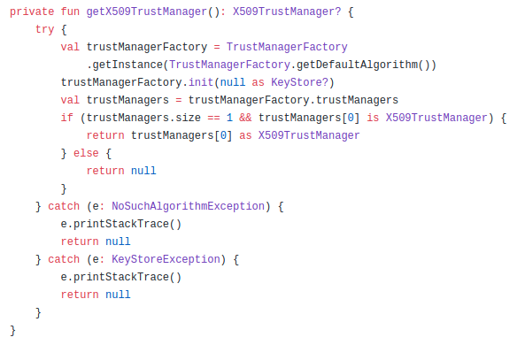
		
	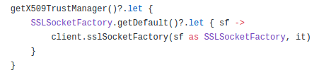

## Retrofit with LiveData
- Với kiến trúc MVVM, chúng ta thường muốn View tương tác với kho dữ liệu thông qua ViewModel để cập nhật dữ liệu mới nhất. Vấn đề xảy ra là phải thực hiện gần như một số kiểm tra mỗi lần nhận được response từ server ví dụ như là:
	+ *response.body* không null
	+ Nếu không có *exception* trong onFailure()
	+ Kiểm tra View nếu như có exception không đúng với dữ liệu của mình.
- Vì thế, trừu tượng hóa toàn bộ quá trình request callback là một giải pháp tốt. Let go:
### API Concerns
- Đầu tiên, Custom lại CallBack<T> để xử lý error, success, exceptions

	

- Tạo model dùng chung cho tất cả kiểu dữ liệu:

	

- Tạo class GenericRequestHandler để xử lý logic, thường sử dụng cho các request tới API.

	

- Tạo class extends *GenericRequestHandler* để cung cấp một makeRequest() và thực hiện request.

	

### View Concerns
- Custom Observer để trả về *exception* hoặc *success*

	

- Quan sát khi dữ liệu thay đổi:

	

## Retrofit với Repository Pattern
- Repository Pattern là một mẫu thiết kế phổ biến, nó tuân theo các nguyên tắc vững chắc dễ sử dụng và code sạch sẽ. 
	+ Tách biệt việc xử lý ở Data Layer và Business Layer
	+ Tách biệt rõ ràng Local Data Source và Remote DataSource
	+ Tránh tình trạng lặp code
	+ Dễ dàng viết Unit Test, giảm rủi ro maintain

- Tạo interface DataSource khai báo các method lấy dữ liệu:

	

- Tạo RemoteDataSource để định nghĩa các phương thức lấy dữ liệu ở Remote:

	

- Tạo class Repository để lấy dữ liệu:

	

## Share OkHttp Client and Converters between Retrofit Instances
- Nếu bạn có nhiều Retrofit instance mà không chú ý bạn sẽ làm giảm performance của app. Vì vậy việc xây dựng một single Retrofit instance sử dụng cho mỗi API với URL khác nhau là một giải pháp tốt.
### Vấn đề của Multiple Retrofit Instances

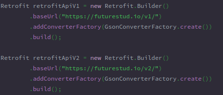

- Ví dụ trên, một OkHttp instance mới cho mỗi Retrofit instance. Điều này dẫn đến ít nhất 2 case OkHttp riêng biệt, mỗi case giữ nhóm request riêng, disk cache, routing logic,... App của bạn sẽ mất hiệu suất một cách không cần thiết.

#### Solution 1: Sharing Default OkHttp Instance

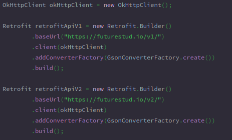

- Ví dụ trên minh họa việc share một OkHttp instance.

#### Solution 2: Sharing Modified OkHttp Instances

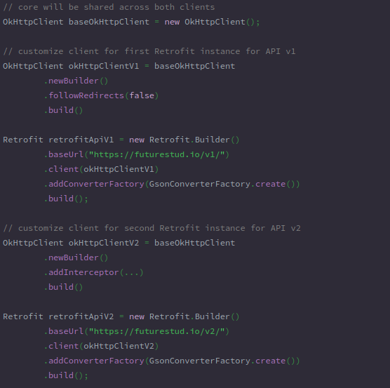

- Với cách này, chúng ta có thể tùy chỉnh từng OkHttp client theo mong muốn, bao gồm cả interceptor nhưng vẫn sử dụng lại 1 OkHttpClient

### Converters

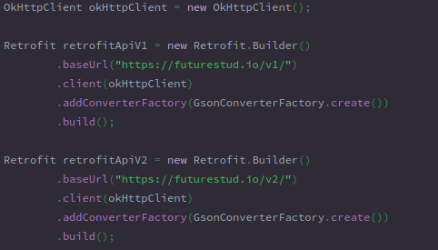

- Với ví dụ trên, chúng ta đang tạo hai case Gson bằng cách gọi riêng GsonConverterFactory.create(). Điều đó có nghĩa 2 case sẽ không chia sẻ bất kỳ bộ đệm nào với nhau. Thay vào đó chúng ta nên chuyển cùng một instance Gson cho 2 Retrofit instance

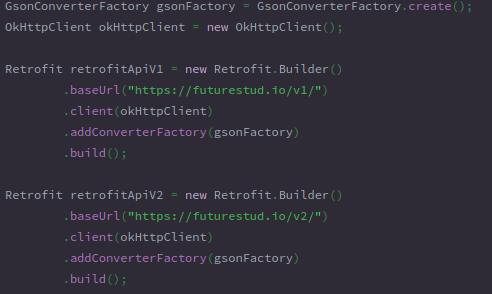

# Tài liệu tham khảo
- OkHttp: https://square.github.io/okhttp/
- https://medium.com/@sotti/android-networking-ii-okhttp-retrofit-moshi-and-picasso-c381f6c0efd8
- https://medium.com/@ssaurel/use-okhttp-to-make-network-requests-on-android-d3845e3c3f50
- https://square.github.io/retrofit/
- https://medium.com/mindorks/tagged/retrofit
