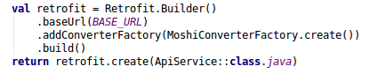
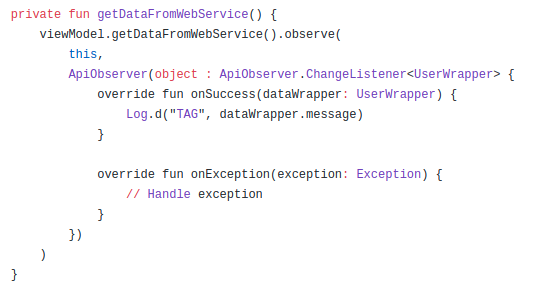

# OkHttpAndRetrofit

# OkHttp
## Overview
- Là một thư viện được Square phát triển với mục đích gửi và nhận các request mạng dựa trên HTTP.
- Là một máy khách HTTP nahnh, hiệu quả:
	+ Hỗ trợ HTTP/2 cho phép tất cả các request đến cùng một máy chủ để chia sẻ một socket.
	+ Gộp connection giảm độ trễ request
	+ GZIP: Giảm kích thước tải xuống.
	+ Caching
	+ Khôi phục từ các sự cố mạng
	+ Hỗ trợ các cuộc gọi đồng bộ, không đồng bộ
	+ Chuyển hướng
	+ Thử lại
- OkHttp cung cấp một triển khai các giao diện HttpUrlConnection và Apache Client bằng cách làm việc trực tiếp trên Java Socket mà không cần sử dụng bất kỳ phụ thuộc nào.
- OkHttp được xây dựng dựa trên Okio, một thư viện bổ sung cho java.io và java.nio để giúp truy cập, lưu trữ và xử lý dữ liệu của bạn dễ dang hơn, nó cung cấp I/O nhanh và 
bộ đệm thay đổi kích thước. Vì thế OkHttp phụ thuộc vào Okio nhưng Okio có thể được sử dụng riêng.
- Sử dụng OkHttp rất dễ dàng, Request/response được thiết kế với fluent builders và immutability.

## Thực hành

## Interceptor

## Cách Android OkHttp cache làm việc

# Retrofit
## Overview
- Retrofit là một type-safe HTTP client cho Java và Android được phát triển bởi Square, giúp dễ dàng kết nối đến một dịch vụ REST trên web bằng cách chuyển đổi API thành Java Interface.
- Từ Retrofit 2 tích hợp thêm phụ thuộc vào OkHttp, phụ thuộc vào Okio. Có nghĩa khi sử dụng Retrofit là bạn đang sử dụng OkHttp và Okio. Ngoài ra không tích hợp bất kỳ bộ chuyển đổi JSON nào để phân tích từ JSON thành Java Object,
thay vào đó nó đi kèm với các thư viện chuyển đổi JSON như Gson, Jackson, Moshi.
- Điểm mạnh:
	+ Dễ dàng kết nối với web-services bằng cách chuyển đổi API sang Java hoặc Kotlin
	+ Dễ dàng add Headers và request type
	+ Dễ dàng tùy chỉnh, thêm bất kuf trình chuyển đổi nào như Gson, JackSon, Moshi, XML... Bạn cũng có thể thêm các interceptor và cache khác nhau.
	+ Cung cấp các chức năng bổ sung như custom header, file uploads, downloads, mocking responses

## Thực hành
- Trong ví dụ này, tôi sẽ chỉ cách sử dụng Retrofit 2 để xử lý các yêu cầu mạng. GET các request từ Endpoint */answers* gắn vào base URL *https://api.stackexchange.com/2.2* 
- Step 1: Add dependency

	

- Step 2: Add permission *Internet*

	

- Step 3: Create model - Tôi sẽ chỉ cho bạn cách phân tích JSON response thành Java Object một cách đơn giản.
	+ Generate Model tự động: Bằng cách sử dụng tool: <a href="http://www.jsonschema2pojo.org/">jsonschema2pojo</a>
	+ JSON sample:
		
		

	+ Map JSON Data to Java: copy và paste JSON response vào tool *jsonschema2pojo* chọn source type: JSON, anotation style có thể chọn Gson hoặc Moshi (Ở đây mình sẽ chọn Moshi)
	+ Chọn Preview để xem kết quả generate:
		
		

	+ Nếu bạn đang sử dụng ngôn ngữ Java bạn có thể copy nó vào project, còn ở project mình đang sử dụng Kotlin nên mình sẽ chỉnh sửa đi một chút

	+ Note: @Json là của Moshi tương đương với @SerializedName của Gson

- Step 4: Create Retrofit Instance
	+ BASE_URL = "https://spring-boot-wall-tags.herokuapp.com/adsharingspace/"

	

- Step 5: Create API Interface

	
	
	+ Tất cả các method phải có HTTP annotation cung cấp request và quan hệ URL: GET, POST, PUT, DELETE, HEAD

	+ Method Paramsters:
		+ @Body: Gửi các đối tượng Java dưới dạng Request
		+ @Query: Sử dụng với tham số truy vấn.
		+ @FormUrlEncoded kết hợp với @Field để gửi dữ liệu đã mã hóa
		+ @Headers: Add headers cho request. Nếu Header cần cho tất cả các request thì ta nên OkHttp Interceptor.

- Step 6: Gửi request

	

	+ *Call<T>*: có thể thực thi đồng bộ hoặc không đồng bộ. Mỗi instance chỉ được gọi một lần, nhưng nếu gọi clone() sẽ tạo ra một instance mới có thể sử dụng. Trong Android, các callback sẽ được thực thi trên Main thread.

## Cấu hình Retrofit 2 trong Android.
- Việc thiết lập Retrofit 2 chạy trong Android là khá dễ dàng, nhưng đôi khi nó trở nên khó khăn hơn khi bạn làm việc cùng với *Authorisation Headers, Basic Authentication & SSL*.
- Logging Interceptor
	+ Tính năng log để hiển thị thông tin request và response trong quá trình phát triển và debug.
	+ Vì việc ghi nhật ký không được tích hợp sẵn trong Retrofit 2 nữa, chúng ta cần thêm một *logging interceptor* cho OkHttp sử dụng interceptor.
	+ Nên add logging vào cuối interceptor, bởi vì điều này cũng sẽ ghi lại thông tin mà bạn đã thêm vào interceptor trước đó.

	

	+ Log levels: NONE, BASIC, HEADERS, BODY
		+ NONE: Bỏ qua mọi hoạt động log.
		+ BASIC: Log request type, url, size request body, response status và size response body.
			
			

		+ HEADERS: Log request, response headers, request type, url, response status

			

		+ BODY: Log request, response headers, body

			

- Authorization Header:
	+ Khi request cần Header ta có thể add vào request, chúng ta có thể thêm vào method hoặc sử dụng OkHttp Interceptor.

	

- SSL Configuration
	+ Mặc định, Retrofit không thể kết nối với API được bảo vệ bởi SSL.
	+ Để thêm chứng chỉ SSL vào Retroofit 2 client:
		

## Retrofit with LiveData
- Với kiến trúc MVVM, MVP, chúng ta thường muốn View tương tác với kho dữ liệu thông qua ViewModel để cập nhật dữ liệu mới nhất. Vấn đề xảy ra là phải thực hiện gần như một số kiểm tra mỗi lần nhận được response từ server ví dụ như là:
	+ *response.body* không null
	+ Nếu không có *exception* trong onFailure()
	+ Kiểm tra View nếu như có exception không đúng với dữ liệu của mình.
- Vì thế, trừu tượng hóa toàn bộ quá trình request callback là một giải pháp tốt. Let go:
### API Concerns
- Đầu tiên, Custom lại CallBack<T> để xử lý error, success, exceptions

	

- Tạo model dùng chung cho tất cả kiểu dữ liệu:

	

- Tạo class GenericRequestHandler để xử lý logic, thường sử dụng cho các request tới API.

	

- Tạo class extends *GenericRequestHandler* để cung cấp một makeRequest() và thực hiện request.

	

### View Concerns
- Custom Observer để trả về *exception* hoặc *success*

	

- Quan sát khi dữ liệu thay đổi:

	

## Retrofit với Repository Pattern
- Repository Pattern là một mẫu thiết kế phổ biến, nó tuân theo các nguyên tắc vững chắc dễ sử dụng và code sạch sẽ. 
	+ Tách biệt việc xử lý ở Data Layer và Business Layer
	+ Tách biệt rõ ràng Local Data Source và Remote DataSource
	+ Tránh tình trạng lặp code
	+ Dễ dàng viết Unit Test, giảm rủi ro maintain

- Tạo interface DataSource khai báo các method lấy dữ liệu:

	

- Tạo RemoteDataSource để định nghĩa các phương thức lấy dữ liệu ở Remote:

	

- Tạo class Repository để lấy dữ liệu:

	

# Tài liệu tham khảo
- OkHttp: https://square.github.io/okhttp/
- https://medium.com/@sotti/android-networking-ii-okhttp-retrofit-moshi-and-picasso-c381f6c0efd8
- https://medium.com/@ssaurel/use-okhttp-to-make-network-requests-on-android-d3845e3c3f50
- https://square.github.io/retrofit/
- https://medium.com/mindorks/tagged/retrofit
